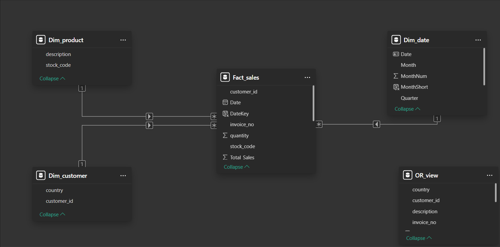
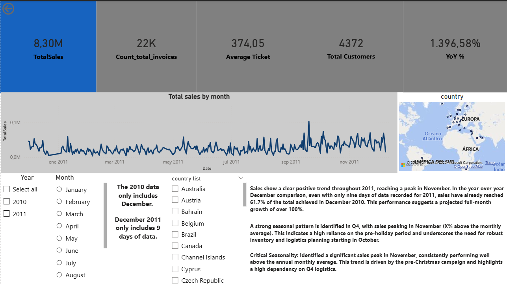
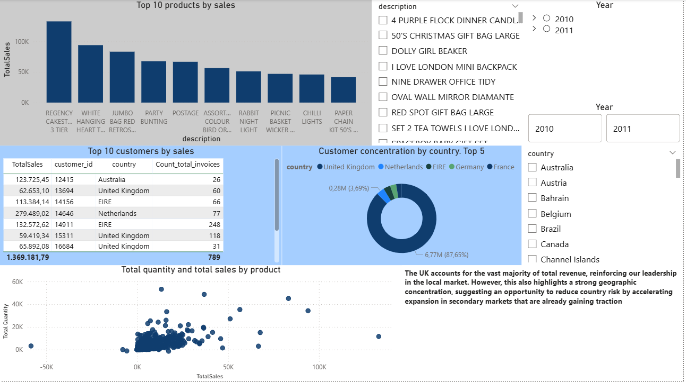

# Online Retail Analysis – Star Schema + Power BI Dashboard

**End-to-end data analytics project** using PostgreSQL for ETL and **Power BI with a professional Star Schema** model.

## Tech Stack
- **Database**: PostgreSQL (Staging → Production architecture + Analytics Views)
- **BI Tool**: Power BI Desktop (Star Schema, Advanced DAX, Time Intelligence)
- **Key Concepts**: ETL Pipeline, Dimensional Modeling, Date Table, Interactive Dashboards

## 📊 Dashboard Insights

### Executive Summary
- Strong seasonality with significant sales peak in **November** every year (pre-Christmas campaign).
- High market concentration: **UK generates ~90% of total revenue**.
- Data quality note: December 2011 contains only 9 days of data.

### Product & Customer Insights
- Netherlands and Australia show significantly higher Average Ticket Size than the UK (high-profit opportunities).
- Top 10 products by sales volume and contribution.
- Scatter plot analysis: Total Sales vs Quantity per product.
- Interactive slicers by Country, Product Description, and hierarchical Date.

## Data Model (Star Schema)

*(Power BI Model view – Fact_sales connected to Dim_date, Dim_customer, Dim_product, and Dim_geography)*

## Screenshots

## How to Replicate the Project

1. Clone this repository.
2. Run the SQL scripts in order (folder `sql_scripts/`).
3. Open the Power BI file:  
   `power_bi/Online_Retail_Dashboard_Star_Schema.pbix`

---

**Project status**: Complete and ready for production-level analysis.
